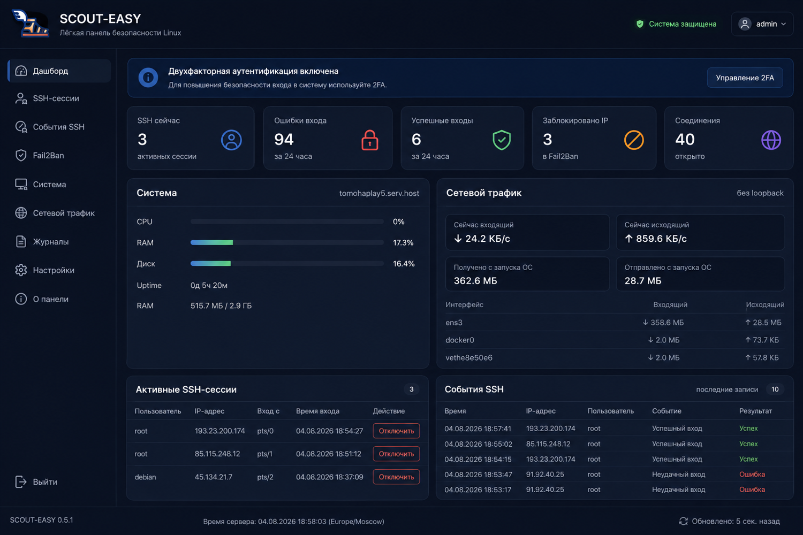
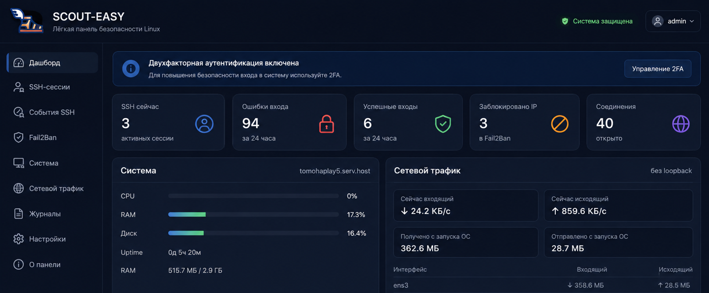
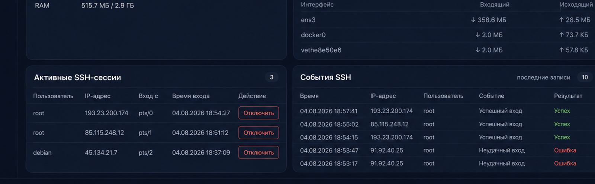

<p align="center">
  
</p>

<h1 align="center">SCOUT-EASY</h1>

<p align="center"><b>Лёгкая self-hosted панель мониторинга и управления безопасностью Linux-сервера.</b></p>

<p align="center">
  SSH · Fail2Ban · сеть · процессы · пользователи · systemd · 2FA · тревоги · аудит
</p>

<p align="center">
  
  
  
  
</p>



<details><summary><b>Дополнительные скриншоты</b></summary>

### Обзор


### SSH и события


</details>

> Все скриншоты демонстрационные: домены, адреса, пользователи и события не относятся к реальному серверу.

## Что это

SCOUT-EASY объединяет в одном интерфейсе сведения, которые обычно приходится собирать через `journalctl`, `ss`, `ps`, `who`, `systemctl` и `fail2ban-client`. Панель показывает состояние сервера, хранит историю трафика и действий, позволяет управлять банами и безопасно останавливать ненужные systemd-службы.

Проект рассчитан на VPS, домашние серверы, небольшую инфраструктуру и администраторов, которым не нужна тяжёлая SIEM-система.

## Возможности

> В 0.8.8 исправлено погашение тревог, добавлена маска 2FA `000-000` и расширенные фильтры для сети и systemd-сервисов.

> В 0.8.2 обновлён интерфейс Fail2Ban: живой статус службы, статистика по jail, явные индикаторы активности и подробная карта событий безопасности.

| Раздел | Возможности |
|---|---|
| Обзор | CPU, RAM, диск, uptime, текущий и исторический сетевой трафик |
| SSH | активные сессии, время входа, успешные и неудачные попытки |
| Сеть | соединения, PID, процессы, RX/TX и фильтры |
| Процессы | CPU/RAM, поиск и подозрительные процессы |
| Пользователи | UID/GID, группы, shell и теги системных/пользовательских учёток |
| Fail2Ban | список jail, ручной бан и разбан IP |
| Сервисы | просмотр systemd-служб, запуск, остановка, enable/disable |
| Журнал | аудит входов и административных действий |
| Тревоги | SSH-брутфорс, аномальный исходящий трафик и всплески соединений |
| Интеграции | Telegram, SMTP, webhook, Zabbix, Prometheus и syslog |
| Профиль | аватар, пароль, TOTP 2FA, тема и выгрузка логов |

## Безопасность

- отдельная страница входа;
- пароль хранится в виде `scrypt`-хеша;
- TOTP 2FA;
- серверная сессия с `HttpOnly`, `Secure` и `SameSite=Strict` cookie;
- CSRF и Origin-проверки для изменяющих запросов;
- rate limiting входа;
- SCOUT-EASY слушает `127.0.0.1` и публикуется через Nginx/HTTPS;
- shell-команды запускаются без `shell=True` и после валидации;
- критические службы защищены от случайной остановки.

> Управление службами — потенциально опасная операция. Не отключайте службу, назначение которой вам неизвестно. `ssh`, `nginx`, `fail2ban`, сетевые службы и сам SCOUT-EASY защищены, но невозможно заранее учесть все особенности конкретного сервера.

## Быстрая установка

Поддерживаются Debian 12+ и Ubuntu 22.04+.

```bash
git clone https://github.com/s-maltseve/scout-easy.git
cd scout-easy
sudo bash install.sh
```

Установщик:

1. установит системные зависимости;
2. создаст `/opt/scout-easy` и Python virtualenv;
3. сгенерирует уникальный логин и стойкий пароль;
4. создаст TOTP-секрет и QR-код;
5. установит systemd-службу;
6. при желании настроит Nginx и HTTPS.

Для автоматического обновления без вопросов:

```bash
sudo bash install.sh --non-interactive
```

## Где посмотреть логин и сбросить пароль

```bash
sudo scout-easy
```

Менеджер позволяет:

- показать логин и QR-код 2FA;
- сбросить пароль;
- пересоздать 2FA;
- проверить статус;
- перезапустить SCOUT-EASY;
- посмотреть журнал;
- проверить сертификат;
- обновить или удалить приложение.

Конфигурация хранится в:

```text
/etc/scout-easy/scout-easy.env
```

Файл доступен только root (`0600`). Пароль в открытом виде после настройки не хранится.

## Публичный HTTPS-доступ

Рекомендуемая схема:

```text
Интернет → Nginx :443 → SCOUT-EASY 127.0.0.1:8765
```

Порт `8765` не нужно открывать в firewall. Ещё безопаснее разрешить доступ к домену только из VPN или доверенной подсети.

## Обновление

```bash
cd ~/scout-easy
git pull --ff-only origin main
sudo bash install.sh --non-interactive
```

Проверка версии:

```bash
curl http://127.0.0.1:8765/api/health
```

## Управление systemd-службами

Вкладка **Сервисы** показывает:

- состояние службы;
- включён ли автозапуск;
- защищена ли служба;
- действия запуска, перезапуска, остановки и отключения.

Пример: если на сервере не используется SMTP, можно найти `postfix.service`, `exim4.service` или другую почтовую службу и остановить её. Перед отключением проверьте зависимости:

```bash
systemctl status postfix.service
systemctl list-dependencies --reverse postfix.service
```

## Тревоги

Текущие базовые правила:

- повышенное количество ошибок SSH;
- критическое количество ошибок SSH;
- аномальный исходящий трафик;
- слишком большое количество соединений;
- процессы, отмеченные коллектором как подозрительные.

Тревогу можно погасить с комментарием. Она не удаляется, а остаётся в истории аудита.

Это эвристики, а не окончательный вывод о компрометации. Высокий трафик или большое количество соединений могут быть нормальными для конкретной нагрузки.

## Интеграции

Каждый канал можно включить или отключить отдельно:

- Telegram Bot;
- SMTP/Email;
- универсальный webhook;
- Zabbix sender/trapper;
- Prometheus;
- syslog/SIEM.

В 0.8.2 интерфейс и безопасное хранение конфигурации подготовлены. Фактическая доставка событий по каналам будет расширяться в следующих релизах.

## Данные и история

SQLite-база:

```text
/var/lib/scout-easy/scout-easy.db
```

В ней сохраняются:

- история сетевого трафика;
- аудит действий;
- тревоги;
- карта активности;
- настройки интеграций.

## Диагностика

```bash
sudo systemctl status scout-easy --no-pager
sudo journalctl -u scout-easy -n 100 --no-pager
sudo ss -lntp | grep 8765
curl http://127.0.0.1:8765/api/health
```

## Roadmap

- [x] Dashboard, SSH, Fail2Ban, сеть и процессы
- [x] 2FA, профиль и Linux-пользователи
- [x] вкладки, история трафика, аудит и базовые тревоги
- [x] управление systemd-службами
- [ ] фактическая отправка Telegram/SMTP/Webhook/Zabbix
- [ ] file integrity monitoring через osquery/Falco
- [ ] Prometheus `/metrics`
- [ ] SCOUT-EASY Hub и отдельные Agent
- [ ] enrollment token, mTLS и несколько серверов
- [ ] стабильный REST API v1

## Multi-server

Будущая архитектура:

```text
SCOUT-EASY Hub
├── Agent: server-01
├── Agent: server-02
└── Agent: server-03
```

Регистрация агента будет выполняться через одноразовый enrollment token, после чего связь перейдёт на mTLS. Обычный постоянный API-ключ для выполнения административных команд использоваться не будет.

## Лицензия

MIT. Смотрите [LICENSE](LICENSE).

## Обратная связь

Ошибки и предложения оформляйте через GitHub Issues. Не публикуйте в issue реальные пароли, TOTP-секреты, приватные ключи, домены внутренней инфраструктуры и полные журналы с персональными данными.

## Изменения 0.8.8

- расширенная диагностика Fail2Ban: служба, управляющий сокет и состояние каждого jail;
- параметры jail: `maxretry`, `findtime`, `bantime`;
- безопасный функциональный тест jail через зарезервированный адрес `192.0.2.1` с обязательным автоматическим разбаном;
- более информативные карточки блокировок и состояния защиты.


## Защита входа в веб-панель

Установщик создаёт jail `scout-easy-login`. Он анализирует `/var/log/scout-easy/auth.log`, не зависит от домена и блокирует IP после трёх неудачных входов в SCOUT-EASY на 6 часов. Порты 80/443 обслуживаются через Nginx, но событие формирует сама панель.
